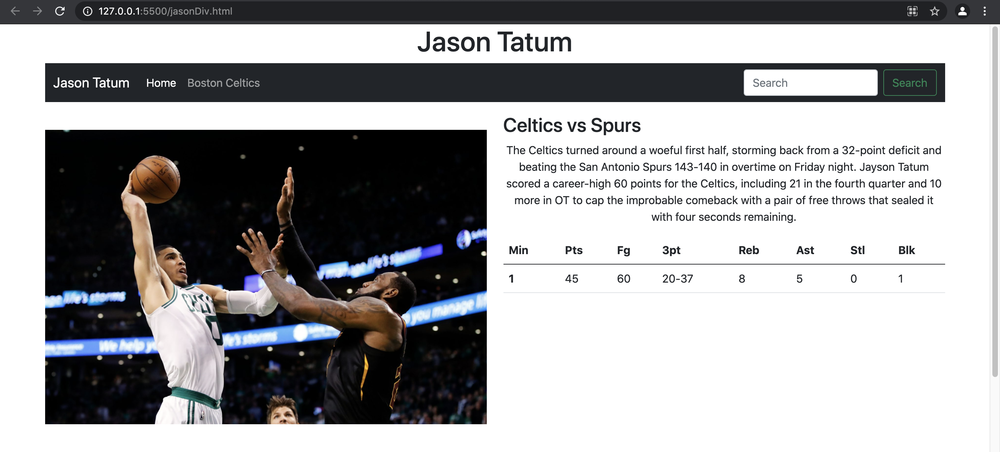

# jasonTatumWebsite

## Technology 
<ul>
<li>HTML5</li>
<li>Boostrap 5</li>
<li>Javascript</>
  </ul>


## Description

A simple webpage insprired by Jason Tatums 60 pt game built with bootsrap and html5 and grid. learned how to use the bootrap grid, 
how to space website correctly, and using tables in bootrap to make the site look nice.



## How to reproduce

you can type the following command to clone my repository

```
git clone https://github.com/jona8888/jasonTatumWebsite

once you have cloned the repository, youy can run in VScode using live server or preferred method.

